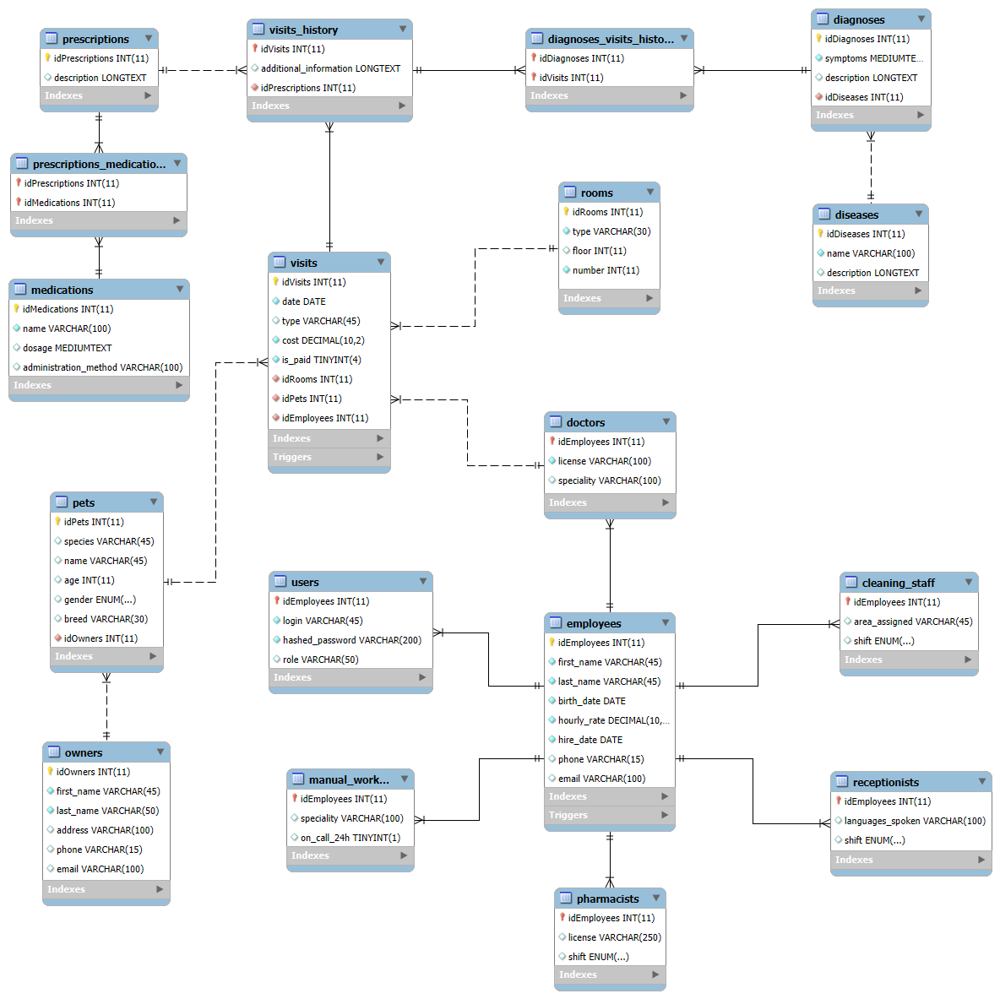

# Author:

Jan Walkiewicz

### EER diagram:

# EN/PL

# EN

### The database code contains the following elements:

1\) Creating tables

2\) Inserting sample data

3\) Creating sample procedures

4\) Creating sample views

5\) Creating sample triggers

### The created database contains the following tables:

1\) **employees** - general information about employees

2\) **users** - information about an employee's account on an external
platform, if such an account exists (does not store account data in the
created database)

3\)
**manual_workers/pharmacists/receptionists/cleaning_staff/doctors** -
additional information about employees belonging to each group

4\) **visits** - information about scheduled visits (filled in by the
person making the appointment)

5\) **rooms** - information about rooms

6\) **visits_history** - information about the course of the visit,
filled in by the doctor

7\) **prescriptions** - information about prescriptions issued by
doctors during a visit

8\) **prescriptions_medications** - allows assigning different
medications to the same prescription and enables the same medications to
appear in different prescriptions

9\) **medications** - information about medications

10\) **diagnoses_visit_history** - allows assigning different diagnoses
to the same visit and enables the same diagnoses to appear in different
visits

11\) **diagnoses** - information about diagnoses

12\) **diseases** - information about diseases

MySQL Workbench was used to create the database.

## Repository structure
| **File**                                                    | **Description**                                                                                                                                                      |
|-------------------------------------------------------------|----------------------------------------------------------------------------------------------------------------------------------------------------------------------|
| `Veterinary_database.sql`                                   | MySQL script containing the database schema implementation. Includes definitions for 18 tables, stored procedures, triggers automating logic, and reporting views.   |    
| `Sample_queries.html/Sample_queries.pdf/Sample_queries.qmd` | Files containing sample queries                                                                                                                                      |
| `EER_diagram.png`                                           | Visualization of the EER diagram for the created database (Visualization of relational architecture, foreign keys, and relationships)                                |

## Cloning repository:

    git clone https://github.com/JanWalkiewicz/Sql_project.git

# PL

### W kodzie bazy znajdują się następujące elementy:

1\) Tworzenie tabel

2\) Wstawianie przykładowych danych

3\) Tworzenie przykładowych procedur

4\) Tworzenie przykładowych widoków

5\) Tworzenie przykładowych wyzwalaczy

### W stworzonej bazie znajdują sie następujące tabele:

1\) **employees** - ogólne informacje o pracownikach

2\) **users** - informacje o koncie na zewnętrznej platformie
przypisanym do pracownika, jeśli dany pracownik takie posiada (nie
przechowuje danych kont w stworzonej bazie)

3\)
**manual_workers/pharmacists/receptionists/cleaning_staff/doctors** -
dodatkowe informacje o pracownikach należących do danej grupy

4\) **visits** - informacje o zaplanowanej wizycie (wypełniane przez
osobę przyjmującą rezerwację wizyty)

5\) **rooms** - informacje o pokojach w klinice

6\) **visits_history** - informacje o przebiegu wizyty wypełniane przez
lekarza

7\) **prescriptions** - informacje o receptach wystawionych przez
lekarzy podczas wizyty

8\) **prescriptions_medications** - pozwala przypisać wiele leków do
jednej recepty oraz umożliwia, aby te same leki pojawiały się na różnych
receptach

9\) **medications** - informacje o lekach

10\) **diagnoses_visit_history** - pozwala przypisać wiele diagnoz do
jednej wizyty oraz umożliwia, aby te same diagnozy pojawiały się na
różnych wizytach

11\) **diagnoses** - informacje o diagnozach

12\) **diseases** - informacje o chorobach

Przy tworzeniu bazy wykorzystano MySQL Workbench

## Struktura repozytorium

|                                                             |                                                                                                                                                                      |
|-------------------------------------------------------------|----------------------------------------------------------------------------------------------------------------------------------------------------------------------|
| **Plik**                                                    | **Opis**                                                                                                                                                             |
| `Veterinary_database.sql`                                   | Skrypt MySQL zawierający implementację schematu bazy danych. Obejmuje definicje 18 tabel, procedury składowane, triggery automatyzujące logikę oraz widoki raportowe |    
| `Sample_queries.html/Sample_queries.pdf/Sample_queries.qmd` | Pliki zawierające przykładowe zapytania                                                                                                                              |
| `EER_diagram.png`                                           | Wizualizacja diagramu EER stworzonej bazy (Wizualizacja architektury, kluczy oraz powiązań)                                                                          |

## Klonowanie repozytorium:

    git clone https://github.com/JanWalkiewicz/Sql_project.git
